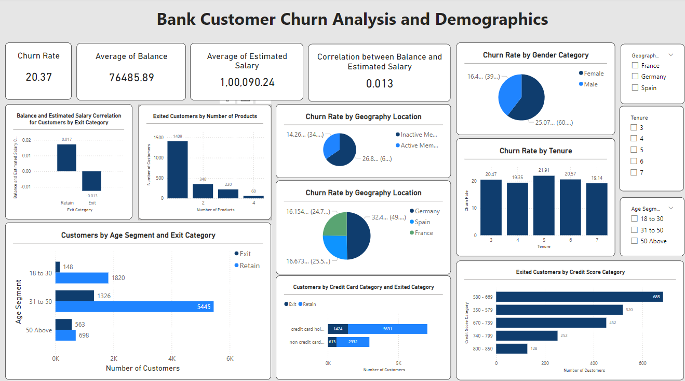

# Bank Customer Analytics and Churn Insights

## Problem Statement
The objective of this project is to analyze customer behavior and churn rates for a fictional bank. By leveraging data from various sources, we aim to uncover insights into what drives customer churn and identify key factors that influence customer retention. The analysis focuses on understanding regional differences in customer behavior, examining the impact of credit cards on churn, and exploring demographic patterns that might suggest risk factors for the bank.

## Dataset
The analysis is conducted using data from multiple CSV files representing different aspects of the bank's operations:
- **`ActiveCustomer.csv`**: Data on customers who are currently active.
- **`Bank_Churn.csv`**: Information on customers who have exited or remained with the bank.
- **`CreditCard.csv`**: Data on customers' credit card usage.
- **`CustomerInfo.csv`**: General demographic and financial information of customers.
- **`ExitCustomer.csv`**: Details on customers who have exited the bank.
- **`Gender.csv`**: Gender information of customers.
- **`Geography.csv`**: Geographic location of customers.

## Methodology
The project uses SQL for data extraction, transformation, and analysis. Key SQL queries were designed to address specific business questions such as:
1. **Distribution of Account Balances Across Regions**: Analyzing how balances differ by geography.
2. **Top 5 Customers by Estimated Salary**: Identifying high-value customers in the last quarter.
3. **Churn Rate by Gender**: Determining gender differences in churn rates.
4. **Impact of Credit Card Ownership on Churn**: Assessing if having a credit card influences the likelihood of customer churn.
5. **Correlation Analysis**: Exploring the relationship between customer attributes like credit score, salary, and balance.

Power BI is used to create an interactive dashboard that visualizes the key insights drawn from the SQL queries.

## Results and Insights
### Key Findings:
- **Geographic Differences**: Regions vary significantly in average account balances, with certain regions showing higher financial activity.
- **High-Value Customers**: The top 5 customers with the highest estimated salaries were identified, providing opportunities for targeted marketing.
- **Churn Rate by Gender**: Analysis revealed that churn rates are slightly higher among one gender, suggesting potential demographic-driven retention strategies.
- **Credit Card Impact on Churn**: Customers with credit cards were found to have a lower churn rate, highlighting the importance of cross-selling credit products.
- **Customer Segmentation**: Customers were segmented based on credit score, age, and tenure to identify high-risk segments. This segmentation can guide personalized retention efforts.

### Dashboard Overview:
The Power BI dashboard provides a visual representation of these insights, including:
- **Customer Churn by Region and Gender**
- **Top Earning Customers**
- **Credit Card Ownership Impact**
- **Customer Segmentation by Credit Score**
- **Trend Analysis of Customer Acquisition**

## Conclusion
This analysis provides a comprehensive view of the factors influencing customer churn at the bank. By understanding the behavior of different customer segments, the bank can develop more effective strategies to improve customer retention. Future steps could include applying machine learning models to predict churn and implementing targeted marketing campaigns based on the insights generated.

## Files
### Reports
- **`Reports/Bank_CRM_Project.pbix`**: Power BI Desktop file containing the interactive report.

### Data
- **`data/ActiveCustomer.csv`**: Contains data on active customers.
- **`data/Bank_Churn.csv`**: Data on customer churn status.
- **`data/CreditCard.csv`**: Information on customers' credit card usage.
- **`data/CustomerInfo.csv`**: Demographic and financial information of customers.
- **`data/ExitCustomer.csv`**: Data on customers who have exited the bank.
- **`data/Gender.csv`**: Gender demographic data.
- **`data/Geography.csv`**: Geographic location data for customers.

### SQL Scripts
- **`SQL/Bank_CRM_Insights.sql`**: SQL script used for data extraction and transformation.

### Exports
- **`Reports/Bank_CRM_Project.pdf`**: PDF export of the Power BI report.
- **`Reports/Bank_CRM_Project.png`**: PNG image of the report dashboard.

## How to Use

### Prerequisites
- **MySQL Server** (or a compatible database system): Required for executing the SQL scripts.
- **Power BI Desktop**: Required for opening and interacting with the `.pbix` file.

### Steps to Run the Project
1. **Set up the database:**
   - Import the provided `.csv` files into your MySQL database.
   - Run the SQL script (`SQL Scripts/Bank_CRM_Insights.sql`) to create and populate the necessary tables for analysis.

2. **Load the Power BI Report:**
   - Open the `Bank_CRM_Project.pbix` file in Power BI Desktop.
   - Ensure that the data sources are correctly linked to your local database.

3. **Interact with the Dashboard:**
   - Explore various insights provided in the dashboard, such as customer churn rates, sales performance, and customer demographics.

### Customizing the Analysis
- **Modifying SQL Queries:** You can edit the SQL queries in the `Bank_CRM_Insights.sql` file to analyze different aspects of the data.
- **Enhancing Visuals in Power BI:** Customize the visuals or add new measures in Power BI to further tailor the analysis.

## Contribution
Contributions are welcome! If you have suggestions or improvements, please submit a pull request or open an issue.

## Preview
Below is a preview of the Power BI dashboard, providing insights into customer behavior, churn analysis, and sales performance:

